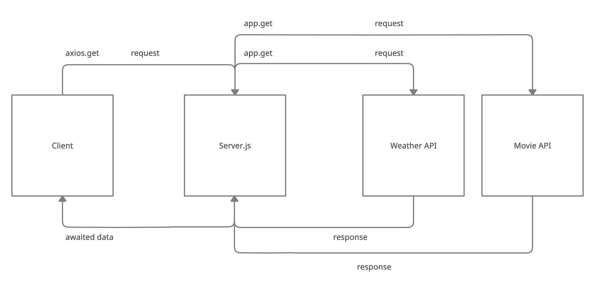

# LAB - 06

## City Explorer

I build an app with a direct and powerful purpose. This app allows you to type in a city and display the longitude, latitude, and a map of the city.

### Author: Mark Thanadabouth

### Collaborators: Phil Murphy, Wil J, Charlie F, Ryan G

### Links and Resources
* [Deployed Link](https://cityexplorermark301n22.netlify.app/)
* [Trello Board](https://trello.com/b/J5ZiKzZu/301n22-cityexplorere)

* WRRC/UML

> 

> 

> 

### Reflections and Comments
* Start date (07/28)
> ### How to build ```.env```
> 1. Go to .gitignore file
> 2. Add ```.env``` under ```# misc```
> 3. Create ```.env``` file in src folder
> 4. In ```.env``` file, type ```REACT_APP_<nameOfKeyInAllCaps>=<key>```

### LAB - 06

Name of feature: Location

Estimate of time needed to complete: 5 Hours

Start time: 2pm-4pm then 7pm-10:30pm

Finish time: 10:30pm

Actual time needed to complete: 5.5 hours

### LAB - 07

Name of feature: Add weather/server

Estimate of time needed to complete: 5 Hours

Start time: 1:30pm

Finish time: 7:30pm (08/01)

Actual time needed to complete: A long time.

## LAB - 08 

Name of feature: Add live weather/server

Estimate of time needed to complete: 7 Hours

Start time: 2:50pm

Finish time: 

Actual time needed to complete: 
